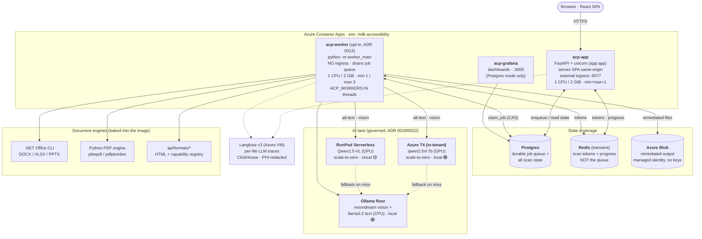
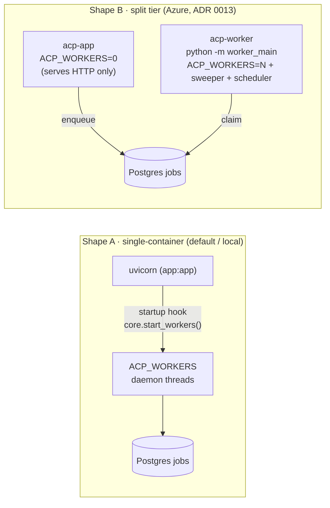
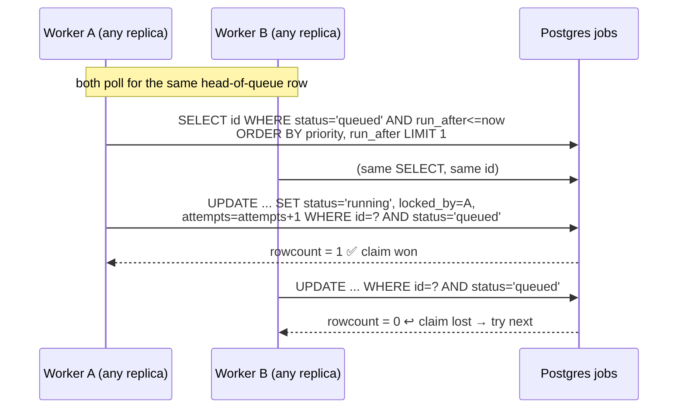
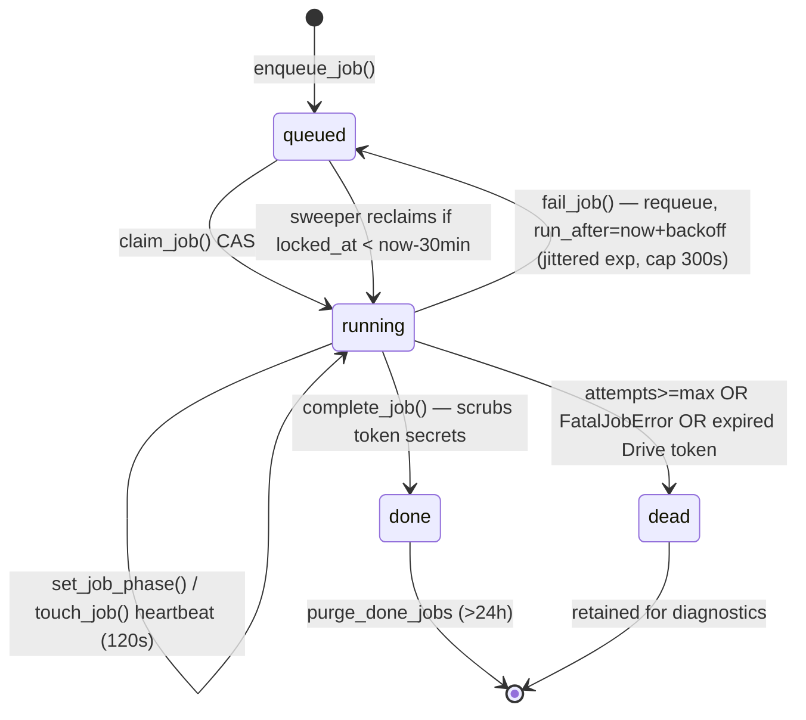
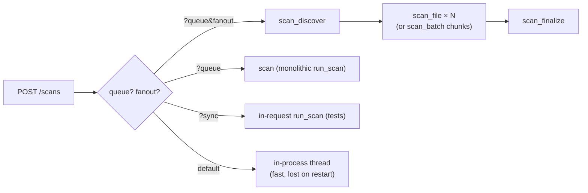
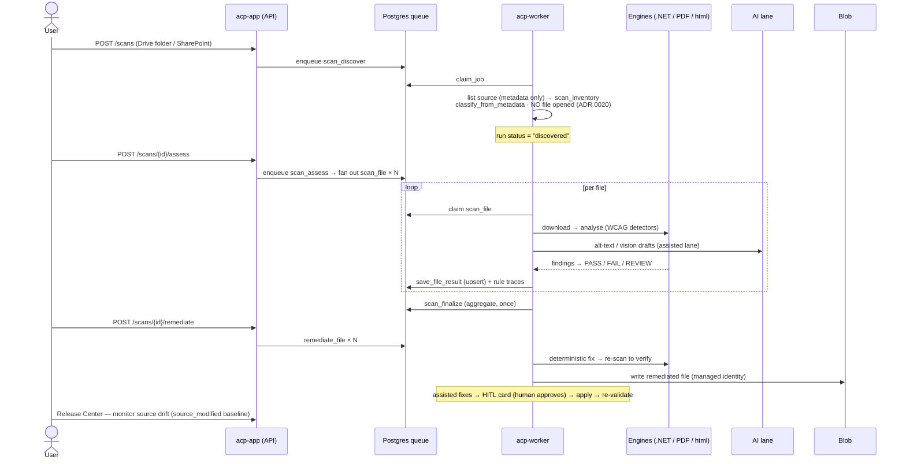
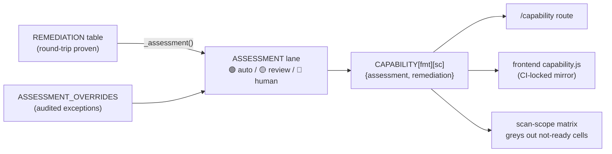
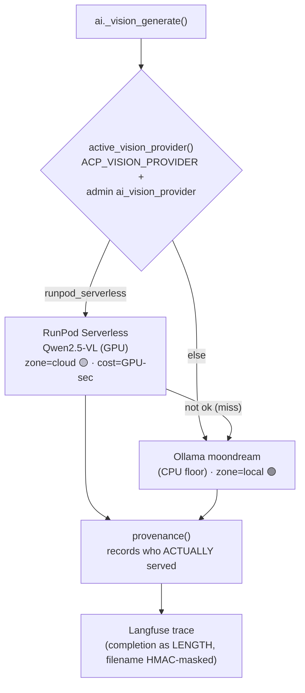
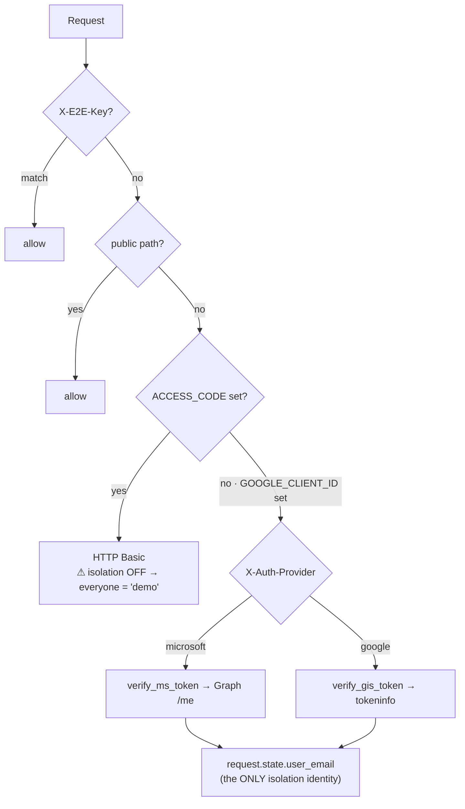
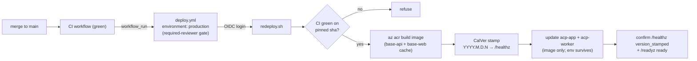

# ACP — System Architecture

> **Production topology, 2026-09-01:** `acp-app` is API-only (`ACP_WORKERS=0`). Queue work is
> owned by three no-ingress Container Apps running the same image: `acp-discovery`, `acp-assess`,
> and `acp-remediate`. The generic production `acp-worker` described in older diagrams below has
> been retired; it remains a valid local/staging topology, not a production component.

> **Movate AccessOps** (customer-facing name; **ACP** is the internal codebase name used
> throughout). A read‑only document‑accessibility assessment + server‑side remediation platform
> for Office/PDF/HTML, deployed on Azure Container Apps. This document describes **how it is
> built** — the worker model, the durable job queue, and every runtime component — as of
> `origin/main`.
>
> Grounded in the code (file:line anchors throughout). Diagrams are Mermaid and render on
> GitHub. Companion to the slide deck in `docs/acp-architecture-deck.md`.

---

## 1. The system in one picture

ACP is **one container image run in two shapes** — an API/UI process and a job‑draining
worker process — sharing one Postgres database, a transient Redis, an object store, and a
pluggable GPU/CPU AI lane.



**Key fact:** `acp-app` and `acp-worker` run the **identical image** (`acp-app:<sha>-<ts>`) and
differ only by entrypoint. One build, two roles — so a capability fix can never be live in the
API and stale in the worker, which is where scanning actually happens
(`deploy/public/redeploy.sh:18-20,340-341`).

### What is (and isn't) a Container App

The public deploy (`deploy/public/deploy.sh`) targets resource group `mdk-accessibility` and
manages three apps:

| App | When created | Role | Size | Replicas | Ingress |
|---|---|---|---|---|---|
| **`acp-app`** | always | FastAPI API + serves the SPA; runs in‑process workers unless the tier is split | 1 CPU / 2 GiB | min=max=**1** (pinned) | external, port 8077 |
| **`acp-worker`** | `ACP_DEPLOY_WORKER=1` | drains the durable queue via `python -m worker_main`; scanning/remediation run here | 1 CPU / 2 GiB | min 1 / **max 3** | **none** |
| **`acp-grafana`** | Postgres mode only | dashboards over the Postgres DSN | 0.5 CPU / 1 GiB | min=max=1 | external, port 3000 |

> **Note vs the old deck:** there is **no `acp-redis` and no `acp-ollama` Container App** anymore.
> Redis is an external managed service via `REDIS_URL`; GPU vision is out of band from this deploy —
> either an **in‑tenant Azure T4** (`gpu_up.sh`, an ACA GPU workload profile in acp‑app's own env) or
> RunPod serverless. The PDF engine is now **in‑tree** (ADR 0029), not vendored. Observability moved to a
> **standalone Langfuse v3 VM** (`acp-langfuse-v3`), separate from these apps.

`acp-app` runs in **single‑revision mode**, so each deploy makes the new revision the sole
100%‑traffic revision automatically (`deploy.sh:186-188`, `redeploy.sh:137-138`).

### External / managed dependencies

| Dependency | Wired via | Used for |
|---|---|---|
| **Postgres** | secret `database-url` → `DATABASE_URL` | durable job queue + all scan state. Unset ⇒ SQLite single‑instance only |
| **Azure Blob** | `ACP_BLOB_ACCOUNT` (default `acpremediatedstore`) | remediated output (ADR 0010); managed‑identity auth, **no keys** |
| **Redis** | secret `redis-url` → `REDIS_URL` | cross‑replica scan tokens + progress. **Required once the worker tier is split** |
| **GPU vision** | `OLLAMA_BASE_URL` (in‑tenant Azure T4) **or** `ACP_RUNPOD_ENDPOINT_ID` + `runpod-api-key` (serverless) | GPU vision. Two options behind the Ollama adapter: an in‑tenant **Azure T4** (`gpu_up.sh`, scale‑to‑zero, stays local 🟢) or RunPod serverless (cloud 🟡). Optional — falls back to CPU floor |
| **Langfuse v3** | `LANGFUSE_HOST` + secrets `langfuse-pk/sk` | per‑file LLM traces (PHI‑safe). Self‑managed **Azure VM** `acp-langfuse-v3` (ClickHouse + Redis + MinIO + Postgres, eastus2) — see §8 |
| **Google / Microsoft** | `ACP_GOOGLE_CLIENT_ID` / MSAL | per‑user Drive/SharePoint sign‑in + isolation identity |

---

## 2. The worker model — one codebase, two shapes

This is the heart of ACP's runtime. The **same Python worker code** runs in one of two
deployment shapes, chosen at deploy time.



- **Shape A — in‑process** (`api/app.py:88-103`). The FastAPI `startup` hook calls
  `core.start_workers()`, spawning `ACP_WORKERS` **daemon threads** inside the uvicorn process.
  Docker Compose uses this with `ACP_WORKERS=4` (`docker-compose.yml:52`). Simple; an API redeploy
  restarts the workers with it.
- **Shape B — split tier** (`api/worker_main.py`). A standalone `python -m worker_main` entrypoint
  runs **only** the worker pool + sweeper + scheduler (no HTTP). `deploy.sh:403-496` stands up a
  separate `acp-worker` Container App (`ACP_WORKERS=N`, default 2), then flips the API to
  `ACP_WORKERS=0`. **Why:** an API/UI redeploy never restarts a running scan (`worker_main.py:4-7`).
  Splitting **requires `REDIS_URL`** or the deploy refuses (`deploy.sh:427-431`) — separate processes
  can't share the in‑memory token dict.

**Concurrency model:** a **thread pool**, not processes. Each worker is a `JobWorker` on a
`threading.Thread(daemon=True)` (`core.py:492-500`); pool size = `ACP_WORKERS`, capped at
`_MAX_WORKERS=16` (`core.py:486-489`). Size is **static** from the deploy‑time env var
(`start_workers()` ignores any persisted count, `core.py:737-752`), with a live, non‑persistent
`set_worker_count(n)` override exposed in the UI for burst.

**DB pool tracks worker count:** `db_max_conn() = max(2, ACP_WORKERS) + 8` headroom, so busy workers
can't starve dashboard polls (`store.py:577-602`).

---

## 3. The durable job queue (ADR 0004)

The queue is a **Postgres `jobs` table** (portable to SQLite; timestamps are ISO‑8601 TEXT so they
sort across both). **Redis is not the queue.**

### Schema (`store.py:259-276`)

```
jobs(
  id TEXT PRIMARY KEY,  type TEXT,  payload TEXT,
  status TEXT DEFAULT 'queued',              -- queued | running | done | dead
  priority INT DEFAULT 100,  attempts INT DEFAULT 0,  max_attempts INT DEFAULT 5,
  run_after TEXT,  locked_at TEXT,  locked_by TEXT,
  campaign_id TEXT,  batch_id TEXT,  scan_id TEXT,   -- scan_id = per-scan isolation key
  last_error TEXT,  created_at TEXT,  updated_at TEXT,  phase TEXT
)
-- idx_jobs_claim2 ON jobs(status, priority, run_after)   -- matches the claim ORDER BY
```

### Claiming — compare‑and‑swap, not `SKIP LOCKED` (`store.py:3637-3656`)



The conditional `UPDATE ... WHERE id=? AND status='queued'` **is** the compare‑and‑swap: two workers
on any replica race the same id, only one gets `rowcount==1`. Ordering is **priority‑then‑time**
(FIFO within a priority band). `FOR UPDATE SKIP LOCKED` is noted as a *future* throughput
optimization and is **not** currently used (`store.py:3596-3602`).

### Lifecycle



- **Heartbeat / lease:** while a handler runs, a thread calls `touch_job` every 120s
  (`worker.py:108-117`), extending `locked_at` past the sweeper's 30‑min cutoff — so a legitimately
  long scan (~10–15 min) isn't reclaimed mid‑flight.
- **Backoff:** capped exponential with **full jitter** (`base=2`, `cap=300s`, `worker.py:84-87`).
- **Terminal‑error classification:** an expired Drive (GIS) token is dead‑lettered immediately (can't
  be refreshed); 403/5xx/timeouts stay retryable (`worker.py:42-73`). `FatalJobError` dead‑letters at
  once. A dead row logs one greppable `job dead-lettered` line for the Log Analytics alert.
- **Secret hygiene:** `complete_job`/`fail_job` scrub `drive_token`/`sp_token`/`token` from terminal
  payloads (`store.py:3672-3706`).

### The sweeper (stuck‑job recovery)

`start_workers()` always starts a `jobsweeper` thread **even at 0 workers** (`core.py:754-780`),
ticking every 60s:
1. `reclaim_stuck_jobs(1800)` — requeues `running` jobs whose lease expired (`store.py:3790-3799`).
2. `rescue_unfinalized_scans()` — deploy‑safety net: a `running` scan with all files persisted but no
   live jobs gets `scan_finalize` re‑enqueued (`store.py:1255-1275`); idempotent via `mark_finalized`.
3. `purge_done_jobs(24h)` hourly so the table/index don't bloat; dead rows retained.

### Job types (`@handler` in `handlers.py`)

| Type | What it does |
|---|---|
| `scan` | monolithic scan — full `run_scan` in one job (pre‑fan‑out fallback) |
| `scan_discover` | fan‑out entrypoint — lists source, creates `scan_runs`, fans out (ADR 0007) |
| `scan_file` | one file: download → analyse → PII → assess → `save_file_result` (upsert) |
| `scan_batch` | chunked file units for large estates (ADR 0008) |
| `scan_assess` | deferred‑analysis kickoff — rebuilds the fan‑out at Assess time (ADR 0020) |
| `scan_finalize` | aggregates `file_records` → `scan_runs` summary; finalize‑once |
| `remediate_file` | one durable job per file — fix + write to `Remediated/` folder |
| `apply_approved_values` | applies HITL‑approved AI values |

**Idempotency:** the fan‑out finalize trigger is **count‑based** — `count_files_done` uses
`SELECT COUNT(*) FROM file_records` (upserted per file), so a retried `scan_file` can't inflate the
count or finalize early (`store.py:1051-1074`, ADR 0013). `mark_finalized` is an atomic
`UPDATE ... WHERE finalized_at IS NULL` so duplicate finalize jobs are safe.

### Fan‑out vs monolithic (ADR 0007)



Fan‑out streams **one file per job** (memory/disk bounded), parallelises downloads (each job builds
its own Drive client), and reuses the same durable queue + atomic claim. It is the default for the
queued path; monolithic (`run_scan` holds every file on one box's 1 GiB disk, ~10k‑file ceiling)
stays as a fallback and backs the sync/test paths. Discovery cap on fan‑out is `ACP_FANOUT_MAX_FILES`
(50k) vs monolithic's 500/1000.

---

## 4. The request lifecycle — one file, end to end

ADR 0020 splits the cheap **Discover** phase from the expensive **Assess** phase.



Stage → code map:

| Stage | Runs in |
|---|---|
| **Discover** (list only) | `handlers.py:798 _scan_discover` → `scanner._list`; classify from metadata |
| **Assess** (download + analyse) | `handlers.py:864 _scan_assess` → `_analyse_and_persist_one` → `scanner.analyse_and_assess` |
| **Risk score** | `Rubric.assess` over `_scoped_for_scoring` — scored on the **frozen** scope only |
| **Remediate** | `handlers.py:421 _remediate_file` → `remediate_office.py` / `remediate_pdf.py` / `remediate.py` |
| **Human review (HITL)** | `routes/hitl.py`; `hitl_queue`; AI drafts in `ai.py`; apply via `_apply_approved_values` |
| **Re‑validate** | post‑apply re‑scan; `validated` flag set only when the SC actually cleared |
| **Release** | `publish.py`; `file_records.published_at/blob_url/drive_write_url` |
| **Monitor** | `routes/system.py:238 monitor_estate`; `source_staleness.py` (upstream drift) |

---

## 5. Data model (Postgres, `store.py` `_SCHEMA`)

Identical schema on SQLite and Postgres. The tables cluster into six groups:

**Scan run + results**
- `scan_runs` — one row per scan: `status` (discover→running→finalized), `owner_email` (tenant key),
  `assessed_at` (presentation gate), `finalized_at` (finalize‑once), and **`scope`** = JSON of the
  frozen per‑scan scope (`scope["scan_scope"]` = criterion→formats map read by `get_scan_scope`).
- `file_records` — per‑scan file snapshot, PK `(scan_id, file)`: `score, compliant, checksum` (Drive
  md5 dedup), `blob_url` (remediated output), **`source_modified`** (staleness baseline).
- `issue_records` — raw findings (`rule_id, wcag, severity, detail, page, location`).
- `scan_rule_traces` — per‑file per‑rule outcome (`NOT_EVALUATED`/`FAIL`/…), scope‑gated.
- `scan_file_manifests` — per rule‑id PASS/FAIL/ERROR manifest.

**Human review + fixes**
- `hitl_queue` — review worklist: `proposals` (prefilled AI fixes), `validated`, `applied`
  (promise‑vs‑fix gate), `resolution` (WCAG exception decorative/essential).
- `applied_fixes` / `remediation_diff` — the actual value written + before→after evidence (verified
  fixes only).
- `remediation_state` — per‑violation state machine `(doc_id, rule_id)` — "3 of 5 fixed" first‑class.
- `hitl_events` — one row per human decision (approve/edit/reject/skip) — calibration signal.

**Governance & lifecycle (ADR 0003)**
- `documents` — long‑lived governed object (stable `doc_id` across renames), classification cols,
  `owner_email` (tenant, separate from business `owner`).
- `scan_inventory` — Discover‑phase metadata (ADR 0020), distinct from `file_records`.
- `disposition_policy` / `disposition_audit` — preview‑only lifecycle.
- `campaign` / `campaign_batch` — durable remediation programs.
- `inventory` — cross‑scan first/last‑seen.

**AI provenance & audit**
- `ai_calls` — append‑only: `provider, model, zone, latency_ms, ok, cost_usd, reason` (backs 🟢/🟡).
- `ai_provider_config` — non‑secret gateway config (never the key).
- `decision_log` — immutable audit (`actor, action, scan_id, file, rule_id`).
- `pii_findings` — orthogonal PII dimension (ADR 0006); samples are **masked** strings only.
- `org_memory` — org‑scoped review guidance (ADR 0021).

**Queue & ops**
- `jobs` — the durable queue (§3). `app_settings` — admin platform config (`ai_enabled`,
  `ai_base_url`, `ai_vision_model`, `scan_scope`, …). `schedule_config` — scheduled sweeps.

**ACP's own conformance report (ADR 0047)** — eight `acr_*` tables, and the one group in this
schema that is **not about customer documents**. See §11.
- `acr_report` — one row per report: product version, `vpat_edition`, evaluation methods, status.
- `acr_criterion` — the matrix. One row per (report × requirement), carrying `requirement_set`
  (`wcag-2.2-aa` / `section-508` / `en-301-549`), `chapter` (the standard's own division), the
  human's `final_status`, and `remarks`.
- `acr_evidence` — what backs a decision: source kind, environment, tester, timestamps.
- `acr_manual_test` / `acr_manual_step` — guided plan runs, one step row per prompt answered.
- `acr_decision_log` — append-only, one row per applicability or status decision.
- `acr_snapshot` — the immutable published revision plus its content digest.
- `acr_role` — per-report grants; publication is gated on these, never on `core.is_admin`.

**Frozen scope** is recorded once at discover/save and never mutated; remediation and the numeric
score read `get_scan_scope` (`store.py:1478`), not the live global — so changing the operator scope
later can't retro‑alter an old scan (removes Remediate/Assess drift).

---

## 6. The three document engines

ACP does not have *an* engine — it has three, split by what each format's ecosystem does best
(ADR 0012).

| Engine | Language | Handles | Invocation |
|---|---|---|---|
| **.NET Office analysers** (`DigitalA11y`) | C# / .NET 10 | DOCX, XLSX, PPTX | shelled per file: `dotnet <CLI> <dir> <out.json>` (`scanner.py:1214-1252`, 180s cap) |
| **Python PDF engine** | Python | PDF structure, tags, reading order, forms | in‑tree (ADR 0029); pikepdf / pdfplumber / pdfminer / pypdf / pypdfium2 + tesseract OCR |
| **`api/formats/*`** | Python | HTML + the capability registry | first‑party detectors + `rule_registry` |

The .NET path has a hardened failure mode: an abnormal CLI exit *with* parseable output marks the
file **`uncertain`** (findings kept, `compliant=False`, score an upper bound) — this closed a bug
where a `SIGABRT` after a complete `File.WriteAllText` was certifying documents
(`scanner.py:1228-1248`).

Detectors register per `(rule × format)` with a **`Coverage`** level (FULL / PARTIAL / HEURISTIC /
DECLARED / UNSUPPORTED). `assess_from_findings` turns findings into PASS/FAIL/REVIEW/NOT_EVALUATED:
a recorded finding always FAILs; **only FULL coverage may certify a clean PASS** — a PARTIAL detector
can fail a file but never pass it.

---

## 7. Assessment: the two‑axis capability matrix (ADR 0023)

Every `(criterion × format)` cell carries **two independent lanes**:

- **Remediation axis** — an authored, round‑trip‑proven table `REMEDIATION[fmt][sc]` →
  `AUTO` / `ASSISTED` / `HUMAN` ("who does the work, and does a human have to?").
  `tests/test_remediation_capability.py` proves every entry against the real remediators and asserts
  its key set equals `store.RULE_FORMATS` exactly.
- **Assessment axis** — **derived** from remediation (`_assessment`, `remediation_capability.py:394`):
  `AUTO ⟹ 🟢 auto` (certify pass & fail), else **🟡 review** (detect, human confirms) — *but only when
  the detector covers the whole criterion*.



`ASSESSMENT_OVERRIDES` carries audited both‑direction exceptions so the derived axis never
over‑claims a certified PASS — e.g. `(pptx, 2.1.1) → 🔴 human` (keyboard operability of a static deck
is a runtime property, nothing to assess); `(pdf/docx, 4.1.2) → 🟡 review` (AcroForm/content‑control
detector is PARTIAL — a clean scan proves the *form fields* are named, not the whole criterion).

**The honesty bar** (ADR 0016): ACP will not report a pass it cannot evidence. Three outcomes
(PASS / FAIL / **REVIEW**), coverage gates certification, and every deterministic fix is re‑scanned
and credited only if the finding is actually gone. This is why the matrix has a remediation axis at
all — anything with a model in the decision path caps at *drafted‑then‑approved*.

---

## 8. AI lanes (ADR 0019 / 0022)

No commercial LLM SDK is in the dependency list — every provider adapter is hand‑rolled `httpx`
against the vendor API, so there is no key and no SDK in the build. `api/providers.py` defines
**five vision adapters** — Ollama (local CPU floor), Azure OpenAI (`zone=tenant`), OpenAI, Anthropic,
and RunPod serverless — behind a **governed provider gateway** with a local floor and an
acceptance‑gated escalation.



- **Vision** — `RunPodServerlessVisionProvider` (Qwen2.5‑VL over an OpenAI‑compatible endpoint;
  key rides only in the request header, never persisted). On any miss it **falls back to the local
  CPU floor** (`_vision_generate`, `ai.py:556-582`) and provenance records whichever provider actually
  served — it never claims GPU when CPU ran. So enabling GPU "can only upgrade quality, never break AI."
- **Acceptance‑gated cloud escalation** (ADR 0019 §2 / 0030) — a local CPU draft is quality‑gated by
  `_is_usable_alt`: a weak model returning non‑empty **garbage** (symbol runs, single tokens) is
  rejected, and the image escalates to a **customer‑approved cloud** provider (Azure OpenAI / OpenAI /
  Anthropic) **only when an admin enabled one and its secret is present** — otherwise it defers to a
  human. Provenance records the transparent numbered escalation path + `cost_usd`.
- **Two GPU options** — RunPod serverless (`zone=cloud` 🟡) and an **in‑tenant Azure T4** (`gpu_up.sh`:
  `NC8AS_T4`, `qwen2.5vl:7b`, in the same ACA env as acp-app, **internal ingress :11434**,
  scale‑to‑zero). Both are reached through the Ollama adapter by repointing `OLLAMA_BASE_URL`, so it
  is a "no‑code" cutover; the Azure T4's internal ingress deliberately keeps the zone chip **local 🟢**
  (data never leaves the tenant), where external ingress would flip it to cloud.
- **Text** — `OLLAMA_MODEL` (llama3.2) via Ollama; degrades to deterministic prose when unreachable.
- **Runtime repoint** — `_maybe_refresh_endpoint()` (30s TTL) re‑reads admin overrides
  (`ai_base_url` / `ai_vision_model`) from `app_settings` and reassigns module globals **live, no
  restart** — the GPU‑burst pattern (`Settings → AI endpoint`, or `PUT /settings`).
- **Provenance 🟢/🟡** — `zone` is derived from the endpoint host (localhost/`.internal`/private IP →
  local 🟢, else cloud 🟡): the "did my document leave my network?" answer.
- **Langfuse (observability)** — env‑gated no‑op when unconfigured (`api/lf.py`). **Two traces per
  scan**: a Scan/Discover trace (file→rule span tree, PII spans) and a separate Assess trace carrying
  the 0–100 `compliance_score`; AI calls are Langfuse *generations* with model / tokens / **cost** /
  zone. PHI‑safe: `user:` tag for per‑user attribution, the filename HMAC‑masked to `doc-<6hex>.<ext>`,
  completions sent as **lengths**, not text. **Now on Langfuse v3 (ClickHouse).** ACP cut over from v2
  to v3 on 2026‑08‑19: the enriched per‑file traces overwhelmed v2's single Postgres (a real 44‑document
  scan hung the Session view), so v3 splits the store into **ClickHouse + Redis + MinIO + Postgres**. It
  runs on a dedicated **Azure VM** — `acp-langfuse-v3`, `Standard_D4s_v3` + a 128 GB Premium data disk,
  **eastus2** — via docker‑compose behind Caddy/TLS, *not* Container Apps (ClickHouse needs real local
  disk, which ACA's Azure Files/SMB mounts fight). The cutover was **host‑only** — `LANGFUSE_HOST`
  repointed + keys re‑seeded, no app change (the PHI invariant above is version‑independent); the v2
  Container App was deleted and trace history was not migrated (start‑fresh). Runbook + compose in
  `deploy/langfuse-v3/` (#447/#449). See the deck's Observability slide for the full picture.

---

## 9. Auth & multi‑tenancy

The access gate is FastAPI middleware (`app.py:34 _access_gate`):



- **Per‑user isolation is ON** iff `GOOGLE_CLIENT_ID` set **and** `ACCESS_CODE` empty
  (`app.py:127`). The `if ACCESS_CODE / elif GOOGLE_CLIENT_ID` order means setting an access code on a
  Google deploy silently turns isolation **off** — a loud startup warning flags it.
- **Owner‑keyed data flow** — `_owner(request) = user_email or "demo"`, stamped on scans at creation;
  every read enforces `owner_email` (`get_scan` returns None on mismatch, `store.py:1423`).
- **Token verification** asks the provider (Google `tokeninfo` / MS Graph `/me`), 9‑min cache — no
  local JWKS. `verify_ms_token` (`core.py:248`) gives Microsoft/Entra users the same posture as Google.
- **Sign‑in asks which account** — sign‑in now forces an account chooser for both Google (GIS) and
  Microsoft (MSAL) rather than silently reusing the browser's single existing session; the two data
  connections stay independent (Drive rides `X-Drive-Token`, OneDrive/SharePoint rides `X-SP-Token`), so a
  personal Drive alongside a work tenant no longer needs a second browser profile.
- **Scope resolution** — the owner sets a global `scan_scope` (`PUT /settings` → `_require_admin` on
  `OWNER_EMAIL`; `is_scope_owner`, on `/me` and `/config`, hides the editor for non‑owners). A
  **per‑user override** layers on top (ADR 0035, `store.set_user_setting` / `resolve_setting`):
  precedence is **per‑user override → owner global default → no restriction**. This is now wired **end to
  end** — the override folds into `active_scope` as a **widen‑only union** (a user may assess *more* than
  the owner mandated, never less), threaded through the two scan‑listing chokepoints
  (`scanner._scope_for_listing` / `handlers._scan_discover`) and **frozen once** into `scan_runs.scope` at
  fan‑out. A signed‑in user manages their own override from a non‑admin surface — `GET/PUT/DELETE
  /settings/mine` (keyed to their email, can never write another's) behind a Settings editor that renders
  the owner‑mandated pairs locked‑on so widen‑only is visible.
- **Sources authenticate differently** — Google Drive (keyless ADC or per‑user GIS), SharePoint/
  OneDrive (Entra via Graph), and the new **SMB on‑prem connector** (ADR 0032/0036): a read‑only
  `svc-acp` NTFS account, credential from Key Vault via Managed Identity, running **inside** the
  customer network and talking to Azure over **outbound‑only HTTPS :443** — so PHI never leaves the
  perimeter to be discovered. (Discovery logic shipped; the live `smbprotocol` transport is
  deployment‑gated — in pilot, not live.)
- **Folder‑level source scope** — a connected source is no longer all‑or‑nothing: each source card carries
  a folder selection (a property of the **connection**, `GET/PUT /sources/locations`), and child folders
  under a selected parent can be **excluded** (pruned at the walk, not post‑filtered). In the scan wizard,
  folder choice is **step 1** (seeded from the card), with the card‑vs‑run precedence explicit: the card
  seeds the wizard, a change applies to that run only, and write‑back is an explicit action shown only once
  they diverge.

---

## 10. Build & deploy



- **Trigger** — **`workflow_dispatch`, and by default only that** (pin a sha, blue‑green). The
  `workflow_run`-on-CI-**completed**-for-`main` trigger is still declared but its job is skipped
  unless the repo variable `PRODUCTION_AUTO_DEPLOY_ENABLED` is `1`; it is unset, so a merge does
  not deploy. (`workflow_run` rather than push because push raced CI.) The workflow itself must
  stay **enabled** — a disabled workflow cannot be dispatched either, which is why the automatic
  path is switched off at the job. Concurrency group `deploy-production`,
  `cancel-in-progress: false`.
- **Gate** — the `production` GitHub environment has **required reviewers** (approval), and
  `redeploy.sh` independently **refuses to ship a sha whose CI isn't green**.
- **Image** — one multi‑stage build: the `web` stage builds the SPA with `VITE_SIM=false` → `/app/static`
  (served same‑origin by FastAPI); the `runtime` stage adds Python + .NET + the PDF engine. Two pinned
  base images (`base-api` deps, `base-web` node_modules) cache the slow layers by content hash.
- **Roll‑out** — `acp-app` + `acp-worker` update **concurrently to the same image** (different
  entrypoints). Optional **blue‑green** (`ACP_BLUE_GREEN=1`) provisions green at 0%, smoke‑tests it on
  its own FQDN while blue serves 100%, then promotes in one weight change (instant rollback).
- **Version** — CalVer `YYYY.M.D.N` baked as a build arg, surfaced at `/healthz`
  (`version_stamped:true`); `/readyz` reports worker heartbeat + engine availability separately.
- **Staging tier (unattended)** — a second chain: `.github/workflows/deploy-staging.yml` +
  `deploy/public/staging_up.sh` ship the **same green commit** to `acp-app-staging` + `acp-worker-staging`
  (same RG, **separate DATABASE_URL**) with **no reviewer gate**, so `main`'s tip is live within
  minutes. Reuses `redeploy.sh` unchanged (same guards); **dormant until** a `STAGING_FQDN` repo
  variable is set. This is why the production gate above can stay strict — the fast, unattended lane
  is staging, not prod (`docs/pipeline.md → Chain B — staging`).

> **Ops note:** the auto‑deploy has been observed to wedge in the Actions queue (runs sit `pending`);
> the documented bypass is `workflow_dispatch` + approval, or a manual `redeploy.sh` under `az login`.

---

## 11. ACP's own conformance report — the ACR workspace (ADR 0047)

Everything above answers *"what is in the customer's documents?"*. This subsystem answers the
inverse — **"what is true of ACP's own UI?"** — and produces the artifact a procurement team asks
for: an Accessibility Conformance Report.

The inversion is the whole design constraint. ADR 0047 rejected extending `assessment_policy` with
WCAG 2.2 precisely because putting "criteria ACP detects in customer files" and "criteria ACP's UI
is judged against" in one table is the conflation most likely to produce a false claim. They are
separate tables, separate rules, separate vocabulary.

**The matrix is built from catalogs, per VPAT edition.** ITI publishes four, and each obliges a
different requirement set — `acr_catalog.build_matrix(report_id, edition)` reads the catalogs and
writes one `acr_criterion` row per requirement:

| Edition | Requirement sets | Rows |
|---|---|---|
| `VPAT 2.5Rev WCAG` | WCAG 2.2 A/AA | 55 |
| `VPAT 2.5Rev 508` | + Revised Section 508 (36 CFR 1194 App. C) | 175 |
| `VPAT 2.5Rev EU` | + EN 301 549 V3.2.1 | 369 |
| `VPAT 2.5Rev INT` | all three | **489** |

`requirement_sets_available()` answers a **conjunction** — a set is offered only when its catalog is
populated *and* the exports can render it — so a future standard cannot open an edition by landing
a catalog alone. An edition this deployment cannot honestly produce is refused at creation
(`routes/acr.py:249`) and again at publication, on stored state.

**The honesty rules are the same bar as §7, turned inward.**

- **An automated pass never produces "Supports."** axe-core evidence is *evidence*, not a decision;
  a criterion stays `needs_review` until a person decides it. This is the ACR's version of "ACP will
  not report a pass it cannot evidence."
- **Four conformance terms, and only four** — Supports, Partially Supports, Does Not Support, Not
  Applicable. Internal workflow states are structurally barred from the conformance column
  (`acr_export_preview._conformance_cell` raises), and `tests/test_acr_export_preview_guard.py`
  exists because a green suite had already been mistaken for evidence that the guard worked.
- **Counts, never a percentage.** Same house rule as the scan side: no compliance score.
- **Publication is gated, then frozen.** `acr_validation.validate` returns every blocker — undecided
  applicable criteria, stale evidence, missing metadata, incomplete manual plans — and
  `POST /acr/{id}/publish` (`routes/acr.py:1134`) refuses while any remains. It is authorised by
  `acr_authz.may_publish`, **never `core.is_admin`**, which returns True for every admin on the
  platform. What publishes is an immutable `acr_snapshot` with a `content_digest`
  (`acr_publish.py:125`) re-verified on every read; a correction is a **new revision**, never an edit.

**One projection, four renderers.** `acr_export_preview.project()` produces the report as pure data;
JSON, HTML, PDF and DOCX all render *that*, so the honesty constraints live once rather than four
times. The Word export is refused outright if it fails ACP's own docx analyser — the one document
this product cannot afford to hand over inaccessible.

**On the ITI VPAT® template (ADR 0053).** The exported document follows the official template's
structure — its section headings, per-level criteria tables and division headings, sourced per
edition from `config/vpat-2.5rev.json` — **without the template file being vendored.** That was a
licensing decision (Option C), not an engineering shortcut. Whether a document ACP generates may be
*called* a VPAT® is a separate service-mark question, still open, which is why every format states
on its face that it is not one.

---

## 12. Where it's weak (named deliberately)

- **`acp-app` is pinned to a single replica** (min=max=1). Horizontal scale is the worker tier only.
- **Deploy can wedge** in GitHub Actions (see ops note above); the fallback is manual and needs
  Azure creds.
- **Isolation is a config invariant, not a mechanism** — an `ACCESS_CODE` on a Google deploy silently
  collapses everyone to the `demo` estate. Guarded only by a startup warning.
- **GPU vision is best‑effort** — both GPU options (in‑tenant Azure T4, RunPod serverless) are
  scale‑to‑zero, so the first request after idle cold‑starts; a miss falls back to the weaker CPU floor
  (correct, but lower quality).
- **The assessment fan‑out shares one flat worker pool** — every `scan_file` job (download, OCR, vision,
  assess, DB write — five stages with opposite constraints) contends for a single `ACP_WORKERS`
  concurrency limit, there is no GPU micro‑batching or VRAM‑shaped limit, and there is no per‑stage
  instrumentation to locate the bottleneck. **ADR 0037** (Track B) is the committed, measure‑first design
  to fix this — bounded per‑stage pools over the existing durable queue, tuned from measured per‑stage
  time — but it is **design only, not yet built**.
- **Langfuse v3 is a self‑managed VM now** — the trace‑volume ceiling is solved (ClickHouse scales the
  Session view), but v3 runs as a hand‑provisioned Azure VM behind Caddy — a box to patch, back up, and
  keep TLS current, provisioned by a runbook (`deploy/langfuse-v3/`) rather than the CI pipeline.
- **Concurrency discipline is documented, not enforced** — `CLAUDE.md` carries the hard‑won rules;
  nothing mechanically prevents breaking them.

---

## 13. Confirmed technical contract (for the deck)

Answers to the questions that recur when scoping the pilot as a production contract, each verified
against `origin/main` with file:line anchors. **Re‑verify before each presentation — the code moves.**

**Model naming — get this right on the slides.** The deployed vision models are **moondream** (the
local CPU floor default, `ai.py:30`) and **Qwen2.5‑VL** (GPU / cloud, `providers.py:531`,
`deploy/public/gpu_up.sh:69`). **It is not LLaVA** — "llava‑class" appears only as a descriptive term in
code comments; `llava:7b` exists solely in a **bake‑off benchmark** script (`deploy/gpu/pull_models.sh`),
never the production deploy. The text model is **`llama3.2`** (`ai.py:24`), **not `llama3.1:8b`** — the
latter survives only as the local `docker‑compose` default (`deploy/compose/docker-compose.yml:65`) and in
historical OOM comments.

| # | Question | Confirmed answer | Anchor |
|---|---|---|---|
| 1 | Alt‑text drafts for every image, or only missing/inadequate? | **Only missing or inadequate.** Vision is gated by `_is_junk_descr(descr)` (empty / generic auto‑name / filename) — the *same predicate the 1.1.1 detector uses*, so an adequately‑described image is never re‑described. | `remediate_office.py:370,147` |
| 2 | Decorative classification + chart interpretation in SC 1.1.1? | **Both, yes.** Decorative = marker (`is_decorative`) + heuristic `infer_decorative` (name/size/pixel), surfaced as a Low‑confidence, human‑confirmed "Mark as decorative" proposal, never auto. Charts = native Office charts read from embedded OOXML data and stated exactly (**no vision, no confabulation**, ADR 0016); only flattened chart *images* fall back to vision. | `remediate_office.py:396–460`; `chart_data.py` |
| 3 | Scanned PDF — vision on every page, or pages selected by raster/OCR? | **Neither as phrased.** Vision is driven by **tagged `/Figure` elements lacking `/Alt`**, page rendered at **150 DPI**, OCR‑anchored, capped at **25 figures/doc**. A scanned = **untagged** PDF gets **no per‑page vision**: `_looks_scanned` (≤5 chars over first 3 pages) only *classifies* it (adds OCR, drops TEXT) and routes it to **human structural tagging**. No raster/OCR pass selects pages for vision. | `remediate_pdf.py:7,29`; `capabilities.py:159–185` |
| 4 | Scanned‑PDF vision — assessment evidence only, or remediation artifacts? | **Remediation artifacts, and only for tagged PDFs.** For a tagged PDF, vision writes `/Alt` and proposes reading order (1.3.2, human‑confirmed). A scanned/untagged PDF gets **neither** automatically — classified and routed to human tagging. | `remediate_pdf.py:193`; `ai.py:999` |
| 5 | HTML in the UTSW pilot scope, or merely engine‑supported? | **Engine‑supported, but in neither shipped scope preset.** HTML has detectors across many SCs, but **both** `acp-core-17` and `engagement-14` are **Office/PDF only — HTML in neither**; the pilot is framed as a SharePoint Office/PDF engagement. **This is a SOW decision** — confirm against the #285 pilot‑scope mapping before asserting it as contract. | `assessment_policy.py:399,100+` |
| 6 | Is `llama3.1:8b` on the same T4 in the proposed Azure config? | **No, on two counts.** `gpu_up.sh` pulls **only the vision model** onto the T4 (`ACP_GPU_VISION_MODEL:-qwen2.5vl:7b`) — no text model. Text (`llama3.2`) runs on the in‑process CPU Ollama floor, not the T4. | `deploy/public/gpu_up.sh:69,236`; `ai.py:24` |

**7 — Cost / queue‑latency limits.**

| Control | Value | Source |
|---|---|---|
| Vision figures per PDF | **25** (`_VISION_MAX_FIGURES`) | `remediate_pdf.py` |
| Vision images per Office doc | **25** (`_VISION_MAX_IMAGES`) | `remediate_office.py:184` |
| PDF page render | **150 DPI** (`_RENDER_SCALE`) | `remediate_pdf.py` |
| Min image size (skip spacers) | **64 bytes** (`_MIN_IMG_BYTES`) | `remediate_office.py` |
| Ollama vision timeout | **120 s** (`OLLAMA_VISION_TIMEOUT`) | `ai.py:40` |
| RunPod (serverless GPU) vision timeout | **240 s** (`RUNPOD_VISION_TIMEOUT`) | `ai.py:45` |
| Availability probe / cold‑start | **3 s / 90 s** (`OLLAMA_PROBE_TIMEOUT` / `OLLAMA_COLD_START_TIMEOUT`) | `ai.py:49–50` |

> **Caveat on Q7:** these are per‑document caps, render DPI, and timeouts. There is **no max‑pixel‑dimension
> downscale on the image sent to the model** — the 96 px / 320 px resizes are for HITL card thumbnails only
> (`proposals.py:129`). Do not claim an input‑image size cap on the slides; it isn't in the code.

---

*Grounded in `origin/main`. Re‑verify container sizes with `az containerapp list -g mdk-accessibility`
and ADR numbers against `docs/adr/` before presenting — the topology moves.*
